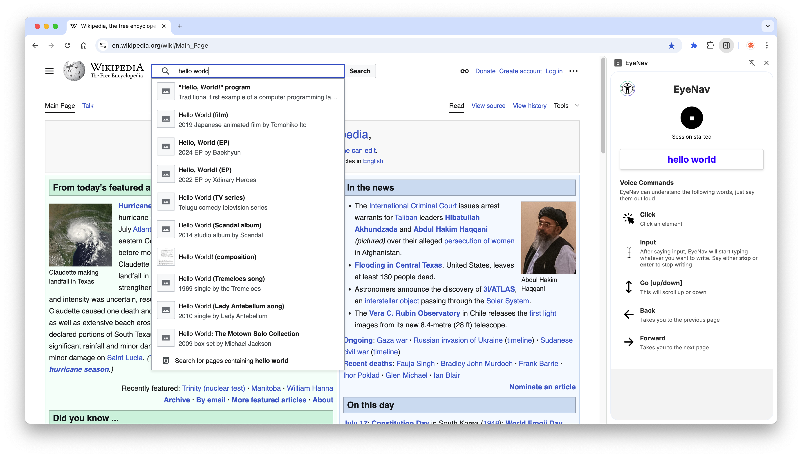
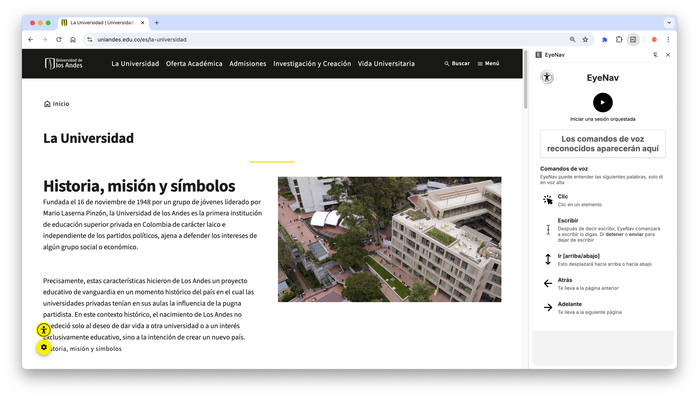
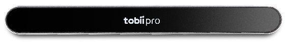
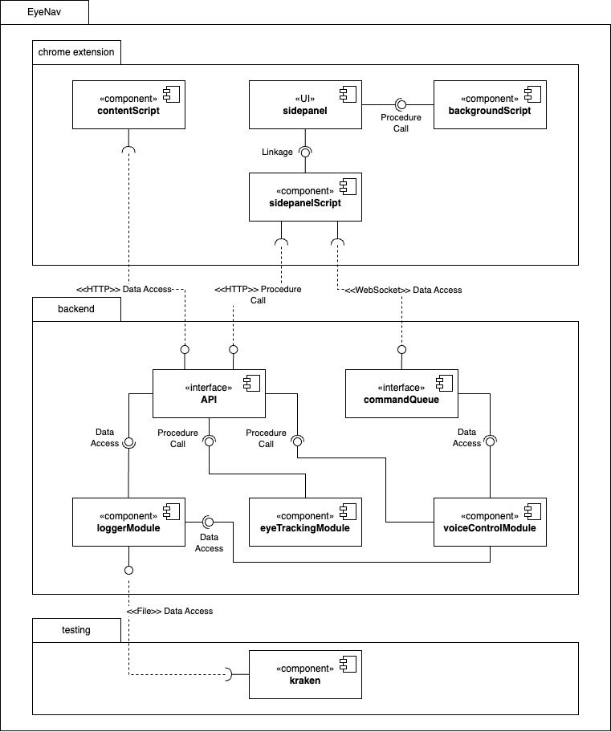
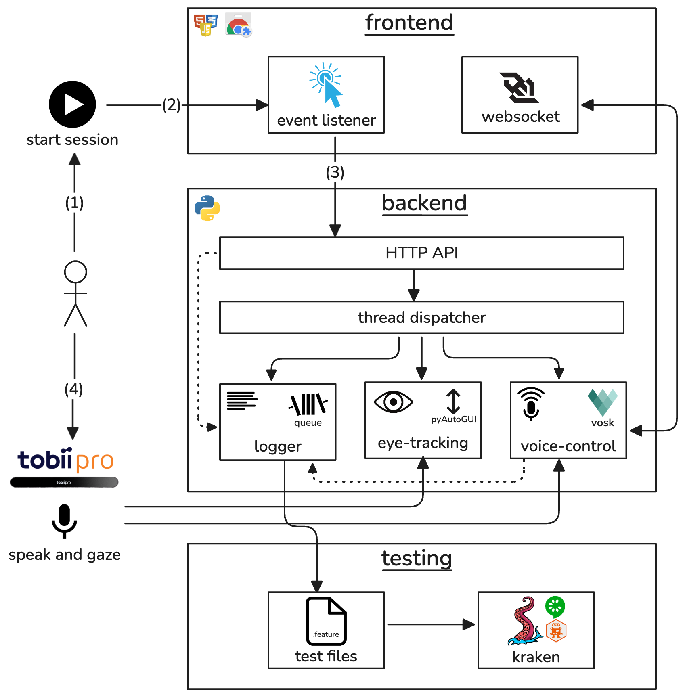

# Purpose

EyeNav is a modular web interaction framework. It fuses real-time eye-tracking (with Tobii-Pro SDK) and on-device natural-language processing (using Vosk) within a Chrome extension and Python backend to deliver:

* **Accessible input** for users with motor impairments
* **Hands-free browser control** for developers and general users
* **Automated test generation** via record-and-replay (Gherkin + WebdriverIO)

By orchestrating gaze-driven pointer control, voice-command parsing, and concurrent logging threads, EyeNav enables both interactive accessibility and behavior-driven development in web environments.

---

# Video

<p align="center">
<iframe width="560" height="315" src="https://youtu.be/INSERT_VIDEO_ID" frameborder="0" allow="accelerometer; autoplay; encrypted-media; gyroscope; picture-in-picture" allowfullscreen></iframe>
</p>

---
# Screenshots




---
# Hardware and Software Requirements


* A Tobii eyetracker
* A microphone
* Google Chrome (v114+)
* Python

---

# Summary

EyeNav implements the following core features:

* **Gaze-Driven Pointer Control**: Maps eye gaze to cursor movements using the Tobii Pro Nano and the `tobii-research` SDK.
* **NLP Command Parsing**: Transcribes and interprets voice commands (click, input, scroll, navigate) with Vosk running locally.
* **Record-and-Replay Test Generation**: Logs interactions in Gherkin syntax and replays them via Kraken & WebdriverIO.
* **Modularity**: Enable or disable any of the three subsystems (gaze, voice, test logger) independently.
* **Internationalization**: Supports English and Spanish out of the box; additional languages via voice-model download and locale translation.

---

## Installation

1. **Clone the Repository**

   ```bash
   git clone https://github.com/your-org/EyeNav.git
   cd EyeNav
   ```
2. **Backend Setup**

   ```bash
   python3 -m venv venv
   source venv/bin/activate
   pip install -r requirements.txt
   ```
3. **Chrome Extension**

   * Open `chrome://extensions/` in Chrome (v114+)
   * Enable *Developer mode*
   * Click *Load unpacked* and select `extension/`

---

# Usage

1. **Start Backend**

   ```bash
   python backend/main.py
   ```
2. **Load Web Page & Extension**

   * Navigate to any web page
   * Click the EyeNav extension icon to open the side panel

3. **Initiate Session**

   * Click **Start** in the side panel
   * Experiment with gaze, voice commands, or both


4. **Generate Tests**

   * Interactions are logged automatically
   * Generated Gherkin scripts appear in `tests/` directory
   * Replay with [Kraken](https://thesoftwaredesignlab.github.io/Kraken/)

---

# Configuration

## Voice Model & Language

* Default support for English (`en`) and Spanish (`es`) models is provided. To download more models, change the preferred language on Chrome. 
* To check for supported languages, see the official [vosk documentation](https://alphacephei.com/vosk/models).
* To add map a new language to the commands, manual translation is required. Add locale code to `commands.json`, with the specified language code.

## Logging & Selectors

* Locator priority for click events:
  1. `href`
  2. `id`
  3. `className`
  4. Computed `xPath`

---

# Architecture

## Components



* **Frontend (Chrome Extension)**: UI panel + event listener + WebSocket client
* **Backend Service**: HTTP API + thread dispatcher spawning:

  * Eye-Tracking Thread (Tobii SDK)
  * Voice Thread (Vosk)
  * Logging Thread (Gherkin generator)
* **Test Runner**: Kraken/WebdriverIO integration for replay

## Context



---

# Use Cases

1. **Accessible Browsing**: Hands-free navigation for users with disabilities.
2. **Automated Testing (A-TDD)**: Generate and replay acceptance tests for regression.
3. **Accessibility Evaluation**: Collect interaction data for consultants and researchers.
4. **Intelligent Agents**: [TBD] Enable bots to navigate and test web UIs via gaze & speech.


